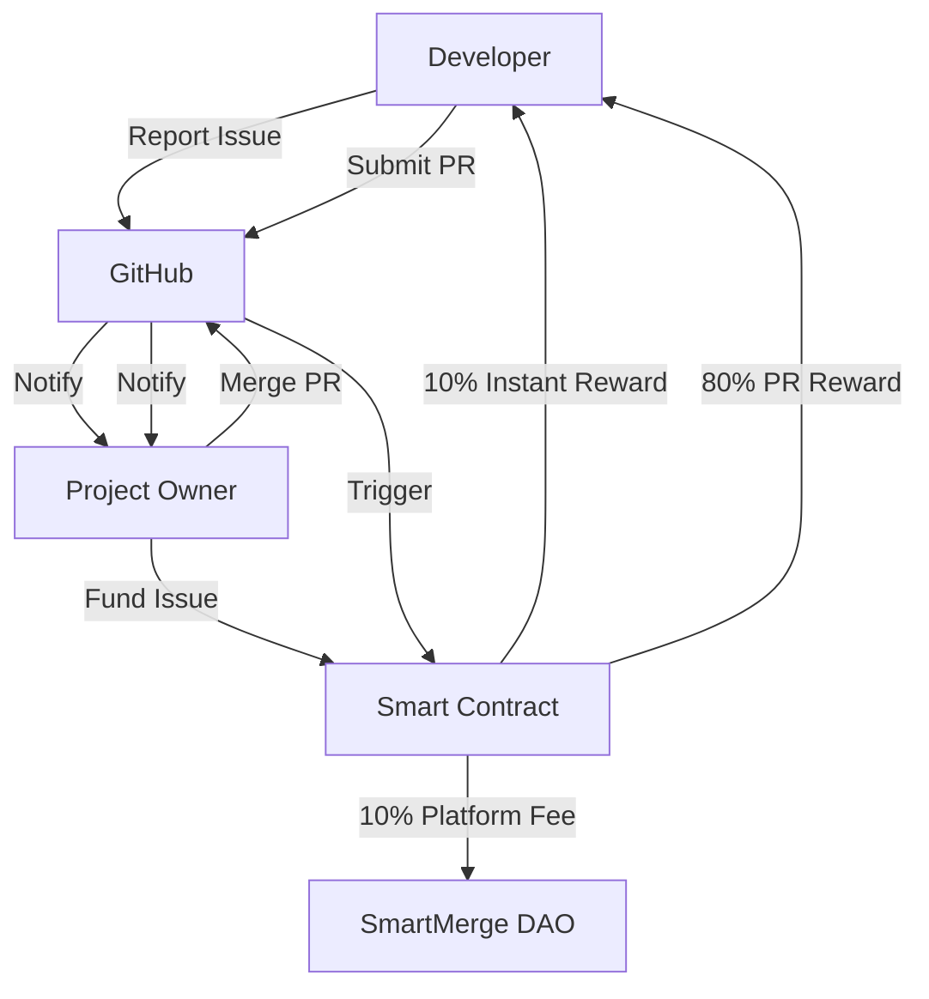
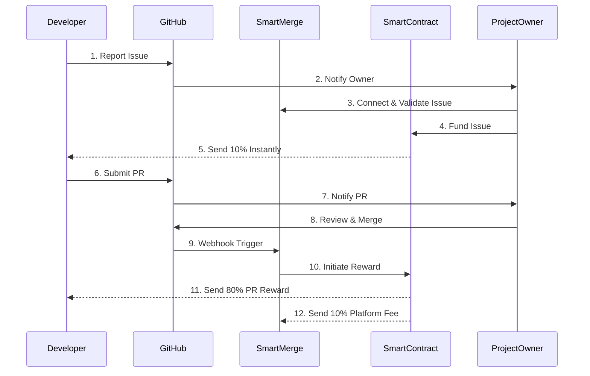

<div align="center">
  
# 🔄 SmartMerge

### *Incentivizing Open Source with Automated Blockchain Rewards*

[](https://opensource.org/licenses/MIT)
[](https://github.com/SmartMerge/.github/stargazers)
[](https://github.com/SmartMerge/.github/issues)
[](https://github.com/SmartMerge/.github/pulls)


**Connecting developers to funded open source projects with instant, automated rewards**

</div>

## 📋 Table of Contents

- [📘 Overview](#-overview)
- [💫 Core Features](#-core-features)
- [🔄 How It Works](#-how-it-works)
- [🏗️ Architecture](#-architecture)
- [🪙 Tokenomics](#-tokenomics)
- [💰 Market Opportunity](#-market-opportunity)
- [🛠️ Getting Started](#-getting-started)
- [🔗 Resources](#-resources)

## 📘 Overview

SmartMerge is building a sustainable ecosystem that automatically rewards bug reporters and PR solvers through blockchain technology. We're creating the first fair-launch protocol with 100% of funds committed to DEX liquidity, targeting the $2.6B open source maintenance market.

> **Currently, less than 2% of open source maintainers are paid for their work.**

SmartMerge solves this by connecting GitHub repositories to smart contracts, creating a seamless reward system that incentivizes both issue reporting and bug fixing with instant, transparent payments.

## 💫 Core Features

| Feature | Description |
|---------|-------------|
| 🐛 **Issue Rewards** | Earn 10% instantly when you report issues that get funded |
| 🔧 **PR Bounties** | Earn 80% when your PR gets merged |
| 🪙 **Auto Payments** | Smart contract-based reward distribution with no middlemen |
| ⚖️ **Fair Valuation** | Transparent reward calculation for all contributions |
| 🔗 **GitHub Integration** | Seamless connection with existing GitHub repositories |

## 🔄 How It Works



### For Developers

1. **Connect** your GitHub account and crypto wallet
2. **Find** funded repositories or report new issues
3. **Earn** instant rewards for issue reporting (10%)
4. **Submit** PRs to fix funded issues
5. **Receive** automated payments when PRs are merged (80%)

### For Repository Owners

1. **Connect** your GitHub repository
2. **Fund** issues that need attention
3. **Review & Merge** quality PRs
4. **Leverage** the open source community to improve your project

## 🏗️ Architecture

SmartMerge uses a robust multi-chain architecture to ensure seamless interaction between GitHub and blockchain networks:



Our contracts are audited and deployed on multiple networks including Ethereum, Polygon, BSC, Avalanche, and Fantom for maximum accessibility.

## 🪙 Tokenomics

SmartMerge features a sustainable token model with **100 Million SMRG** total supply:

| Allocation | Amount | Percentage |
|------------|--------|------------|
| Liquidity Offering | 80,000,000 SMRG | 80% |
| Bounties | 15,000,000 SMRG | 15% |
| Contributors & Airdrops | 5,000,000 SMRG | 5% |

### Value Accrual Mechanisms

- **DAO Treasury**: Protocol fees accrue to the SmartMerge DAO Treasury, controlled by SMRG token holders via governance
- **Buy-Back & Liquidity**: 5% of all protocol fees are used to buy SMRG from the market and add back to liquidity pools
- **Governance**: SMRG holders govern the protocol, including treasury allocation and protocol upgrades

## 💰 Market Opportunity

SmartMerge is targeting a massive and growing market:

| Metric | Value |
|--------|-------|
| GitHub Users | 128M+ |
| Public Repositories | 200M+ |
| Companies Using OSS | 87% |
| Maintenance Value | $2.6B |

### Competitive Advantage

| Feature | SmartMerge | GitCoin | GitHub Sponsors |
|---------|------------|---------|-----------------|
| Automatic Payouts | ✅ | ❌ | ❌ |
| Reporter Rewards | ✅ | ❌ | ❌ |
| 100% Liquidity | ✅ | ❌ | ❌ |
| Token Value Accrual | ✅ | ✅ | ❌ |

## 🛠️ Getting Started

### For Developers

```markdown
1. Connect your GitHub account
2. Link your crypto wallet
3. Start finding funded issues or reporting new ones
4. Submit PRs to earn rewards
```

### For Repository Owners

```markdown
1. Connect your GitHub repository
2. Fund your repository with SMRG or other supported tokens
3. Set reward amounts for issues
4. Review and merge quality PRs
```


---

<div align="center">

## Join the Future of Open Source Contribution


[](https://smartmerge.ai)

</div>
